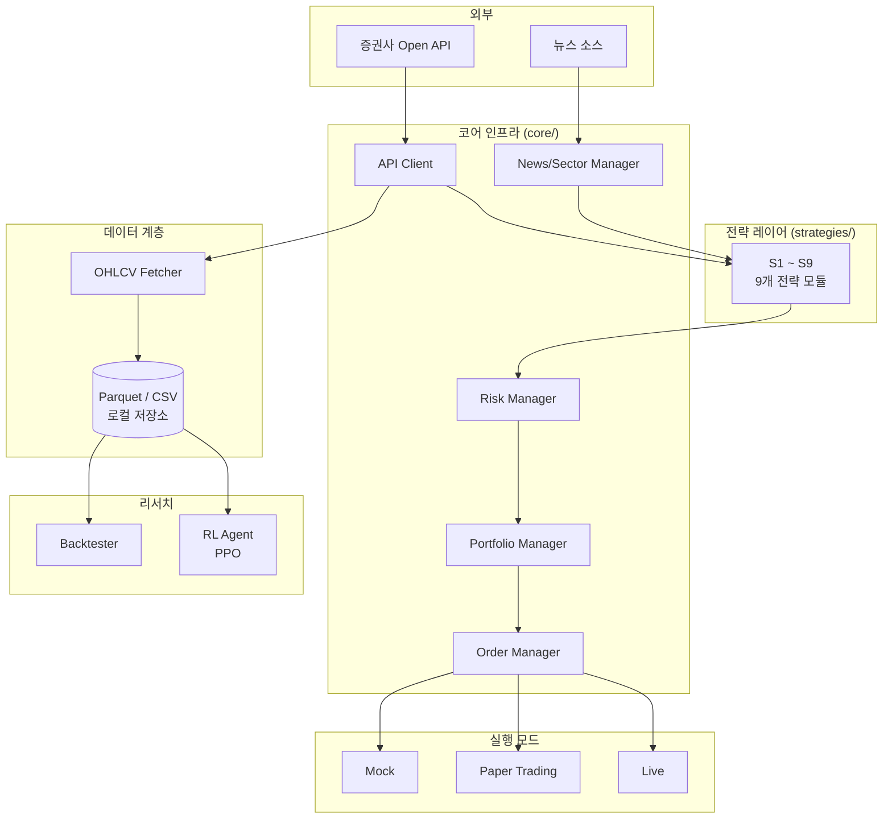
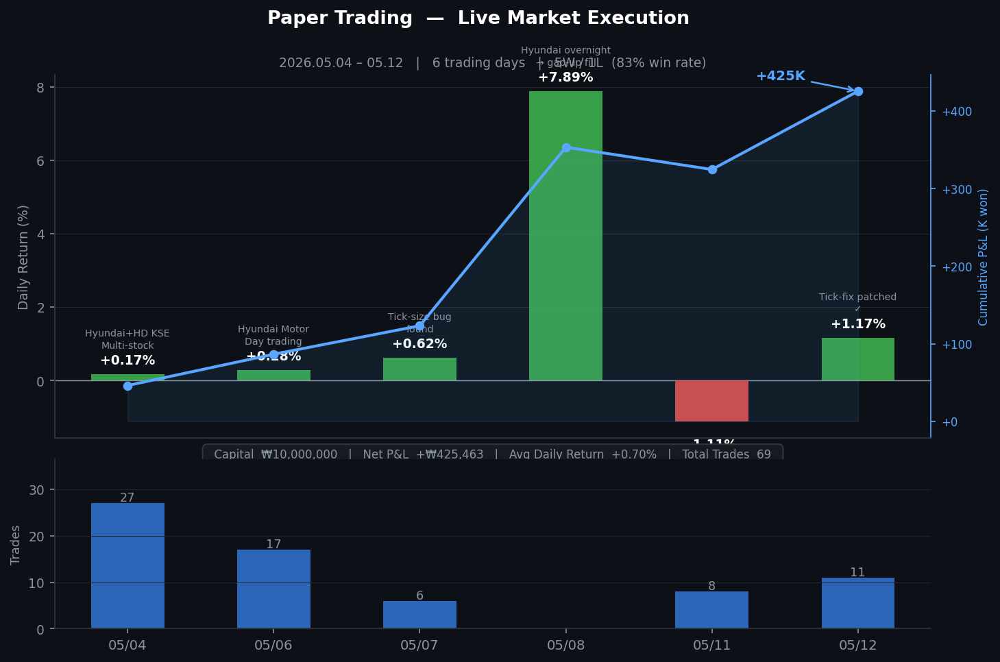
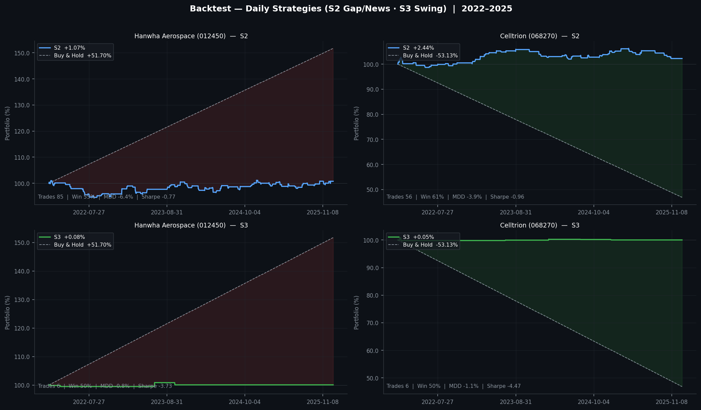
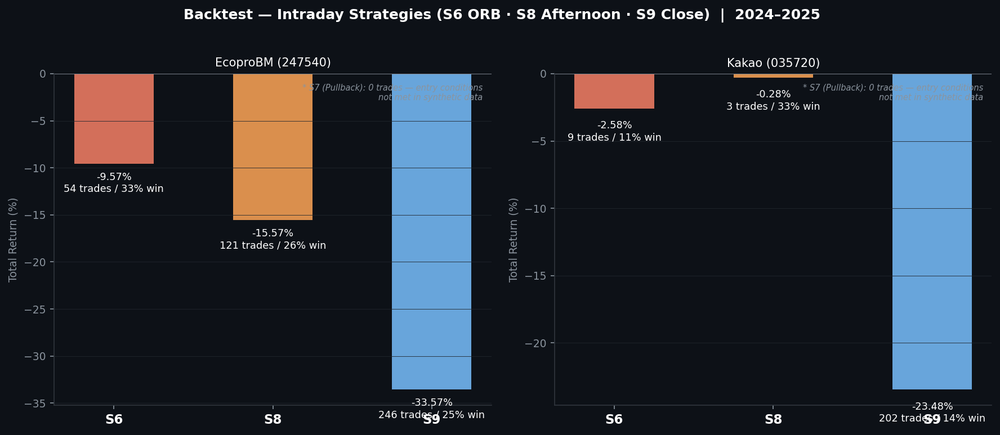

# 📈 Auto-Trade — 한국주식 자동매매 시스템

> 증권사 Open API 기반 한국주식 자동매매 시스템.  
> 9개 트레이딩 전략, PPO 강화학습 에이전트, 백테스팅 · 페이퍼트레이딩 · 실거래 3단계 통합 파이프라인.


---

## 왜 만들었나

수동 매매는 감정 개입, 시간 제약, 규칙의 비일관성이라는 구조적 한계가 있다.  
이 프로젝트는 9개의 전략을 코드로 명문화하고, 백테스트 → 페이퍼트레이딩 → 실거래로 단계적으로 검증하는 자동매매 파이프라인을 구현한다.  
또한 Gymnasium 환경을 직접 구현해 PPO 강화학습 에이전트를 트레이딩에 적용하는 실험적 구조를 포함한다.

---

## 핵심 특징

- **3단계 안전 전환 아키텍처** — `TRADING_MODE=mock → paper → live` 순으로 전환. 실투입 전 최소 2주 페이퍼트레이딩 강제
- **9개 트레이딩 전략 모듈화** — 장초변동성, ORB, 스윙모멘텀, 뉴스섹터 등 독립 모듈로 구현. 신전략 추가 시 기존 코드 수정 불필요
- **PPO 강화학습 에이전트** — Gymnasium 환경 자체 구현. 19개 기술지표 → 3액션(HOLD/BUY/SELL), 수수료·세금 포함 리워드 설계
- **실거래 현실성 반영** — 수수료 0.015%, 증권거래세 0.2%, 슬리피지 0.03%, 호가단위, 상하한가 ±30% 모두 백테스터에 적용
- **CI/CD 자동화** — GitHub Actions로 평일 08:30/14:25 KST 정시 자동 모의매매 실행

---

## 기술 스택

| 카테고리 | 기술 |
|----------|------|
| Language | Python 3.11+ |
| Data | pandas 2.1+, numpy 1.26+, pyarrow (Parquet) |
| ML / RL | stable-baselines3 2.2+, gymnasium 0.29+, PyTorch 2.1+ |
| API / Async | requests, aiohttp 3.9+, websocket-client 1.7+ |
| Visualization | matplotlib |
| Testing | pytest, pytest-asyncio |
| CI/CD | GitHub Actions |

---

## 아키텍처



---

## 디렉토리 구조

```
auto-trade/
├── core/               # API 클라이언트, 포트폴리오/리스크/주문 관리 인프라
├── strategies/         # S1~S9 트레이딩 전략 모듈 (BaseStrategy 상속)
├── backtester/         # 수수료·세금·슬리피지 반영 백테스팅 엔진
├── paper_trading/      # 실시간 가상 주문 시뮬레이터
├── rl_agent/           # PPO 기반 강화학습 환경 (Gymnasium)
├── config/             # 전략 파라미터, 상수, 환경변수 관리
├── scripts/            # 데이터 수집·섹터 점수 계산·일괄 백테스트 유틸리티
└── tests/              # 유닛/통합 테스트 (pytest + pytest-asyncio)
```

---

## 전략 카탈로그

| ID | 전략명 | 시간대 | 핵심 로직 |
|----|--------|--------|-----------|
| S1 | 장초변동성 | 09:15~25 | 당일저점 반등 + 거래량 급증 + 호가 매수세 확인 |
| S2 | 시간외갭 | 장전 | 전일 시간외 +2% 이상 갭 + 뉴스 확인 후 단타 |
| S3 | 스윙모멘텀 | 주봉 | 52주 신고가·저항 돌파 + 테마강도 기반 멀티데이 스윙 |
| S4 | 변동성필터 | 상시 | 지수 변동성 기준으로 다른 전략 ON/OFF 제어 |
| S5 | 뉴스섹터 | 장전 | 장전 뉴스 섹터 점수 계산 → 대장주 추종 → 5일선 추종 |
| S6 | 돌파 | 장초 | Opening Range Breakout (ORB) |
| S7 | 풀백 | 장중 | 고점 후 눌림목 매수 |
| S8 | 오후추세 | 13:00~ | 오후 방향성 확인 후 추세 추종 |
| S9 | 종가베팅 | 장마감 전 | 종가 부근 단기 모멘텀 단타 |

---

## 페이퍼트레이딩 결과 (실시장 검증)

실제 증권사 API에 연결해 모의투자 환경에서 실행한 결과. 실시장 데이터 기반.

| 기간 | 거래일 | 승/패 | 누적 손익 | 일평균 수익률 | 총 거래수 |
|------|--------|-------|-----------|--------------|-----------|
| 2026.05.04 – 05.12 | 6일 | **5W / 1L (83%)** | **+₩425,463** | +0.70% | 69 |



> 운영 중 발견한 주요 버그 및 수정 이력 (05/07 tick-size 보정 오류, 05/11 side-aware 패치 적용 후 체결률 개선).  
> 페이퍼트레이딩 → 실거래 전환 전 최소 2주 운영을 원칙으로 한다.

---

## 백테스트 결과 샘플

> 시뮬레이션 데이터 기반 (GBM). 수수료 0.015% + 증권거래세 0.2% + 슬리피지 0.03% 반영.  
> 실데이터 재현: `fetch_ohlcv.py`로 수집 후 `run_backtest.py` / `run_intraday_backtest.py` 실행.

### 일봉 전략 — S2 시간외갭 · S3 스윙모멘텀 (2022–2025)

| 전략 | 종목 | 수익률 | MDD | 샤프 | 승률 | 거래수 | B&H |
|------|------|--------|-----|------|------|--------|-----|
| S2 시간외갭 | 한화에어로스페이스 (012450) | +1.07% | -6.36% | -0.77 | — | 85 | +51.70% |
| S3 스윙모멘텀 | 한화에어로스페이스 (012450) | +0.08% | -0.82% | -3.73 | — | 6 | +51.70% |
| S2 시간외갭 | 셀트리온 (068270) | +2.44% | -3.91% | -0.96 | — | 56 | -53.13% |
| S3 스윙모멘텀 | 셀트리온 (068270) | +0.05% | -1.06% | -4.47 | — | 6 | -53.13% |

> S2는 하락장(셀트리온 B&H -53%)에서 절대 수익을 유지하며 시장 중립적 특성을 보인다.  
> S3는 보수적 진입 조건(52주 신고가 + 테마강도 + 저항 돌파 동시 충족)으로 거래 횟수가 적다.



### 분봉 전략 — S6 ORB · S8 오후추세 · S9 종가베팅 (2024–2025)

| 전략 | 종목 | 수익률 | 승률 | 거래수 |
|------|------|--------|------|--------|
| S6 ORB돌파 | 에코프로비엠 (247540) | -9.57% | 33% | 54 |
| S8 오후추세 | 에코프로비엠 (247540) | -15.57% | 26% | 121 |
| S9 종가베팅 | 에코프로비엠 (247540) | -33.57% | 25% | 246 |
| S6 ORB돌파 | 카카오 (035720) | -2.58% | 11% | 9 |
| S8 오후추세 | 카카오 (035720) | -0.28% | 33% | 3 |
| S9 종가베팅 | 카카오 (035720) | -23.48% | 14% | 202 |

> 분봉 전략은 시뮬레이션 데이터의 한계(실제 호가·체결 미반영)로 승률이 낮게 나타난다.  
> S7 풀백은 진입 조건(오전 +1% 후 눌림목 -1.5%~-4%)이 시뮬레이션 환경에서 발생 빈도가 낮아 0회 기록.



---

## 빠른 시작

```bash
# 1. 의존성 설치
pip install -r requirements.txt

# 2. 환경변수 설정
cp .env.example .env
# .env 파일에 증권사 API 키 입력

# 3. OHLCV 데이터 수집
python fetch_ohlcv.py --code 005930 --name 삼성전자

# 4. 백테스트 실행 (일봉 전략)
python run_backtest.py --csv data/ohlcv/005930.csv --strategy S3 --code 005930 --name 삼성전자

# 5. 분봉 백테스트
python run_intraday_backtest.py --csv data/ohlcv/005930_1m.csv --strategy S6

# 6. 페이퍼트레이딩
TRADING_MODE=paper python main.py

# 7. RL 에이전트 학습
python rl_agent/train.py
```

---

## 테스트

```bash
pytest tests/ -v
```

| 테스트 범위 | 파일 |
|-------------|------|
| 증권사 API 연동 | `tests/test_api.py` |
| 전략 신호 검증 (S5 뉴스섹터) | `tests/test_strategies.py` |
| 리스크 관리 로직 | `tests/test_risk.py` |
| 뉴스 수집기 | `tests/test_news.py` |
| 백테스터 | `tests/test_backtester.py` |

---

## 로드맵

- [ ] RL 에이전트 페이퍼트레이딩 통합 및 실거래 전환
- [ ] 멀티종목 포트폴리오 최적화 (MVO / 리스크 패리티)
- [ ] 실시간 수익률 대시보드 (웹 UI)
- [ ] 전략별 파라미터 자동 최적화 (Optuna)

---

## 면책 조항

> 이 프로젝트는 교육 및 연구 목적으로 작성되었습니다.  
> 실거래에 사용할 경우 발생하는 금전적 손실에 대해 책임지지 않습니다.
